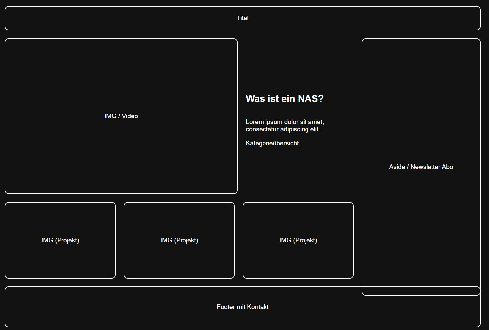

# m293_NAS-Portfolio_Dokumentation

## Vergleich ChatGPT vs Gemini
Folgend sind Kriterien und Vergleiche der LLMs ChatGPT und Gemini
### Kriterien:
- Wurde das Problem gelösst? (Ja/Nein)
- Kompetenz der Lösung (wie gut wurde es gelösst)

## 1. Anwendung: Grundgerüst
Ich habe Gemini Fast und LeChat Mistral folgendes Skript und das Wireframe gegeben. 
### Skript
Erstelle die Website mit HTML, Inhaltlich soll es leer sein, nur das Gerüst. Nutze folgendes Wireframe als Vorlage. Darauf ist ein Layout für Smartphone, Tablet und Desktop. Kümmere dich dabei noch nicht um ein responsives Design, es soll jedoch später möglich sein, dieses Design responsiv zu machen. Nutze keine Frameworks! <br>
Folgendes [WireFrame](./WireFrame-NAS_Portfolio.drawio.pdf) als Anhang.

### Antwort Gemini
Das ist ein sehr sauberer Wireframe! Ich habe dir ein Grundgerüst erstellt, das die Struktur (Mobile, Tablet, Desktop) originalgetreu abbildet.

Um die Umsetzung später so einfach wie möglich für das **responsive Design** zu machen, verwende ich **CSS Grid** und **Flexbox**. So musst du später nur die Media-Queries hinzufügen, um zwischen den Layouts zu wechseln.

### HTML-Struktur (`index.html`)
Ich habe semantische HTML5-Tags (`header`, `main`, `aside`, `footer`) verwendet, da dies der Standard für modernes Webdesign ist.

```html
<!DOCTYPE html>
<html lang="de">
<head>
    <meta charset="UTF-8">
    <meta name="viewport" content="width=device-width, initial-scale=1.0">
    <title>NAS Website Wireframe</title>
    <link rel="stylesheet" href="style.css">
</head>
<body>

    <div class="container">
        <header class="header">
            <div class="box">Titel</div>
        </header>

        <main class="main-content">
            
            <section class="hero-section">
                <div class="main-image-box">IMG / Video</div>
                
                <div class="content-text">
                    <h2>Was ist ein NAS?</h2>
                    <p>Lorem ipsum dolor sit amet, consectetur adipiscing elit...</p>
                    <div class="category-link">Kategorieübersicht</div>
                </div>
            </section>

            <section class="projects-grid">
                <div class="project-box">IMG (Projekt)</div>
                <div class="project-box">IMG (Projekt)</div>
                <div class="project-box">IMG (Projekt)</div>
            </section>

        </main>

        <aside class="sidebar">
            <div class="aside-box">
                Aside / Newsletter Abo
            </div>
        </aside>

        <footer class="footer">
            <div class="box">Footer mit Kontakt</div>
        </footer>
    </div>

</body>
</html>
```

---

### CSS-Styling (`style.css`)
Damit das Layout wie in deinem Wireframe aussieht (schwarzer Hintergrund, weiße Rahmen), habe ich die entsprechenden Styles definiert. Die Abstände sind so gewählt, dass sie dem Desktop-Layout entsprechen.

```css
/* Grund-Einstellungen */
body {
    background-color: #121212;
    color: white;
    font-family: sans-serif;
    margin: 0;
    padding: 20px;
}

.container {
    max-width: 1200px;
    margin: 0 auto;
    display: grid;
    /* Vorbereitung für Desktop-Layout */
    grid-template-columns: 1fr 300px; 
    grid-template-areas: 
        "header header"
        "main sidebar"
        "footer footer";
    gap: 20px;
}

/* Platzhalter Box-Styling */
.box, .main-image-box, .project-box, .aside-box {
    border: 2px solid #ffffff;
    border-radius: 10px;
    padding: 20px;
    display: flex;
    align-items: center;
    justify-content: center;
    text-align: center;
}

/* Bereiche zuweisen */
.header { grid-area: header; }
.main-content { grid-area: main; }
.sidebar { grid-area: sidebar; }
.footer { grid-area: footer; }

/* Hero-Bereich (Bild links, Text rechts) */
.hero-section {
    display: flex;
    gap: 20px;
    margin-bottom: 20px;
}

.main-image-box {
    flex: 2;
    height: 350px;
}

.content-text {
    flex: 1;
    display: flex;
    flex-direction: column;
    justify-content: center;
}

/* Projekt-Raster unten */
.projects-grid {
    display: flex;
    gap: 20px;
}

.project-box {
    flex: 1;
    height: 150px;
}

/* Sidebar Höhe anpassen */
.sidebar .aside-box {
    height: 100%;
    min-height: 500px;
}

.footer .box {
    height: 60px;
}
```

### Wie es weitergeht:
* **Für Tablet/Mobile:** Da wir CSS Grid (`grid-template-areas`) und Flexbox nutzen, kannst du später einfach per Media-Query die `flex-direction` auf `column` stellen oder die Spaltenbreite im Grid auf `1fr` ändern.
* **Inhalt:** Du kannst jetzt die Platzhalter-Texte durch echte Inhalte ersetzen.

Soll ich dir zeigen, wie man die erste Media-Query für die Smartphone-Ansicht hinzufügt, oder möchtest du erst einmal die Desktop-Struktur verfeinern?



### Antwort LeChat

<!DOCTYPE html>
<html lang="de">
<head>
    <meta charset="UTF-8">
    <meta name="viewport" content="width=device-width, initial-scale=1.0">
    <title>NAS - Network Attached Storage</title>
    <style>
        body {
            font-family: Arial, sans-serif;
            background-color: #121212;
            color: #ffffff;
            margin: 0;
            padding: 0;
        }
        .container {
            max-width: 1200px;
            margin: 0 auto;
            padding: 0 20px;
        }
        header {
            background-color: #1e1e1e;
            padding: 20px 0;
            text-align: center;
        }
        nav {
            display: flex;
            justify-content: center;
            background-color: #333;
            padding: 10px;
        }
        nav a {
            color: #fff;
            text-decoration: none;
            padding: 10px 20px;
        }
        .hero {
            text-align: center;
            padding: 50px 0;
            background-color: #1e1e1e;
            margin: 20px 0;
        }
        .hero img {
            max-width: 100%;
            height: auto;
        }
        .content-section {
            display: flex;
            margin: 20px 0;
            background-color: #1e1e1e;
            padding: 20px;
        }
        .content-section .text-content {
            flex: 2;
            padding: 20px;
        }
        .content-section .aside {
            flex: 1;
            background-color: #333;
            padding: 20px;
        }
        .projects {
            display: flex;
            justify-content: space-between;
            flex-wrap: wrap;
            margin: 20px 0;
        }
        .project-card {
            flex: 1;
            margin: 10px;
            background-color: #333;
            padding: 20px;
            min-width: 200px;
        }
        footer {
            background-color: #000;
            text-align: center;
            padding: 20px 0;
            margin-top: 20px;
        }
    </style>
</head>
<body>
    <header>
        <div class="container">
            <h1>NAS - Network Attached Storage</h1>
        </div>
    </header>
    <nav>
        <a href="#">Home</a>
    </nav>
    <div class="container">
        <section class="hero">
            <h2>Titel</h2>
            
        </section>
        <section class="content-section">
            <div class="text-content">
                <h2>Was ist ein NAS?</h2>
                <p>Lorem ipsum dolor sit amet, consectetur adipiscing elit.</p>
                <h3>Kategorieübersicht</h3>
            </div>
            <aside class="aside">
                <h3>Aside</h3>
                <p>Newsletter Abo</p>
            </aside>
        </section>
        <section class="projects">
            <div class="project-card">
                <h3>Ein paar einzelne Projekte</h3>
                
            </div>
            <div class="project-card">
                
            </div>
            <div class="project-card">
                
            </div>
        </section>
    </div>
    <footer>
        <div class="container">
            <p>Footer mit Kontakt</p>
        </div>
    </footer>
</body>
</html>


Das HTML-Gerüst für deine NAS-Website ist fertig! Es basiert auf dem Wireframe und enthält alle notwendigen Abschnitte: Header, Hero-Bereich, Hauptinhalt, Projekte und Footer. Die Platzhalter für Bilder und Texte sind bereits eingebaut, sodass du später einfach Inhalte hinzufügen kannst. Möchtest du noch Anpassungen am Layout oder an den Styles vornehmen?

### Auswertung
Auswertung & VergleichBeim Vergleich der beiden KIs sind mir folgende Punkte aufgefallen:

**Benutzerfreundlichkeit:** LeChat bietet eine direkte Preview, was Zeit spart. Gemini trennt HTML und CSS strikt, was für den modularen Aufbau meiner Website sauberer ist.

**Layout-Treue:** Gemini liegt deutlich näher an meinem Wireframe. Der aside-Bereich wurde korrekt rechts neben dem Content platziert, während LeChat den aside eher einfach unter den Textblock geschoben hat.

**Technische Mängel:** Gemini hat einen kleinen Bug im CSS – die Sidebar und der Footer überlappen sich leicht, weil die Grid-Reihen nicht strikt genug definiert wurden. Das muss ich manuell korrigieren. LeChat ist fehlerfrei, aber eben auch viel simpler aufgebaut.

**Fazit:** Der Punkt geht an Gemini. Obwohl ich den CSS-Fehler fixen muss, bietet mir die Grid-Struktur eine viel bessere Basis für die geforderte responsive Umsetzung auf Smartphone und Tablet.

**Lerneffekt:** Ich habe gemerkt, dass KIs bei komplexeren Wireframes mit CSS Grid (Gemini) präziser arbeiten als mit einfachem Flexbox-Stacking (LeChat), auch wenn man kleine Bugs im Code selbst finden und korrigieren muss.